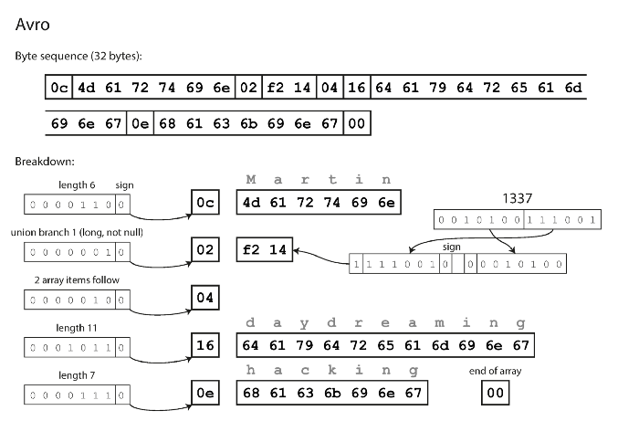

---

layout: post
title: 데이터 중심 애플리케이션 설계 - 부호화와 발전 1
date: 2022-08-28 21:05:23 +0900
category: DE
use_math: true
tags:
- 데이터 중심 애플리케이션 설계
- 부호화와 발전
- 데이터 형식

---

이 글은 Martin Kleppmann의 데이터 중심 애플리케이션 설계를 읽고 기억하고자 적는 게시글입니다.

# 4. 부호화와 발전

이번에 알아 볼 내용은 **부호화**입니다.

부호화라는 주제를 생각하면 해킹을 방지하기 위한 암호화나 네트워크 통신에서 사용되는 코드등을 생각 할 수 있지만, 여기서 부호화는 **A 프로세스에서 메모리를 공유하지 않는 B 프로세스와 데이터를 통신하거나 혹은 파일을 저장 할 때 사용하기 위한 바이트 형태로의 데이터 변환**이라고 말 할 수 있을 것 같습니다.

쉽게 말하는 **직렬화와 역직렬화**라고 말하면 될 것 같습니다.

## 1. 유연한 부호화는 무엇인가?

부호화를 주제로 삼으면 몇 가지 중요한 요소가 있습니다. 간단히 알아보면 다음과 같이 볼 수 있습니다.

1. 확장성(하위 호환성과 상위 호환성)이 있는가?
2. 적은 공간을 사용하는가?

파이썬으로 AI 관련 작업을 하다보면 모델의 파라미터나 특정 정보를 변경했을 때 이전에 저장 한 정보를 joblib 혹은 pickle로 역직렬화를 시도 할 때 문제가 발생하는 경우가 있습니다.

이러한 pickle 같이 특정 언어 체계에서 자체적으로 인메모리의 정보를 외부로 내보내기 위한 방법이 **내장 이진 부호화**입니다. **내장 된 이진 부호화는 보통 애플리케이션에 종속되어 있습니다.** 즉 파이썬에서 부호화 한 파일을 자바에서 열 수 없습니다.

파이썬에서 부호화 한 정보를 자바에서 사용하기 위해서는 결국에는 **외부에서 데이터의 형태를 이해 할 수 있는 별도 방식**이 필요합니다. 우리가 원하는 것은 결국 **"어느 프로세스든지 X 규칙을 사용하면 해석(복호화) 할 수 있게 하자"** 입니다.

즉 **표준화**가 중요합니다.

## 2. 표준화 된 부호화

어느 프로세스에서든 복호화 할 수 있는 부호화 중 가장 잘 알려진 것은 **JSON, XML, CSV**가 있습니다. XML은 불필요하게 복잡하다는 이야기가 있고, csv는 컬럼명을 별도 표기하고 그 이후는 값을 ,(delimeter)로 구분하는 부호화 방식 정도임을 알고 JSON에 대해서 더 깊게 알아보겠습니다.

### 이진 부호화

위에서 본 부호화는 모두 사람이 데이터를 볼 수 있도록 **텍스트 기반** 부호화 방식입니다. 하지만 텍스트 ( 주로 UTF-8 )로 이루어져 있기 때문에 이진 파일로 압축 한 부호화 방식보다는 훨씬 많은 공간을 사용하게 됩니다.

결국 인메모리의 데이터를 효율적으로 부호화 하기 위해서는 **이진 형태의 부호화**를 사용해야 합니다. 그리고 **그 형태가 JSON 형식을 따르면** 복호화 하는데에 있어서 일관 된 방식을 사용 할 수 있습니다.

아래의 이진 부호화 방식은 다음의 데이터를 부호화 한 것 입니다.

```JSON
{
	"userName" : "Martin",
	"favoriteNumber" : 1337,
	"interests" ["daydreaming", "hacking"]
}
```

### JSON ( Message Pack )

JOSN 파일을 이진화 하는 가장 기본적인 방법은 다음과 같은 부호화 방법입니다.


가장 처음부터 이 값들의 객체에 대한 정보부터 그 내용을 모두 비트로 표현 한 방법입니다. 자세하게 알아 볼 필요는 없지만 이 방식이 거의 대부분의 JSON 파싱 방법입니다.

### JSON Compact

위의 비트들을 최소한으로 줄여서 나타낸 방법이 있습니다. 


필드의 이름을 직접적으로 저장하는 것 대신 그 순서를 저장하는 방식으로 변경하면서 데이터를 압축하고, 이로인해 레코드의 필드 이름을 변경하는 것에 대해 어느정도 대처하고 상위 호환성과 하위 호환성을 최소한으로 확보 한 방법입니다.

여기서 **순서만을 저장**하는 것은 **스키마**를 따로 저장하기 때문임을 기억하면 됩니다. 순서만을 저장하기 때문에 필드의 이름을 바꾸더라도 읽는데에 어려움을 없습니다.

이정도만 알아보겠습니다.

### 아브로 (Avro)

Avro는 하둡 프로젝트에서 자주 사용되는 이진 부호화 방식으로 데이터 압축률이 높고, 스키마를 분리해서 사용하면 대용량의 데이터에 적합한 방법입니다.

이 부분은 다음의 [링크](https://n-a-y-a.tistory.com/entry/%ED%95%98%EB%91%A1%EC%97%90%EC%BD%94%EC%8B%9C%EC%8A%A4%ED%85%9C-Apache-Avro-%EC%95%84%ED%8C%8C%EC%B9%98-%EC%97%90%EC%9D%B4%EB%B8%8C%EB%A1%9C)를 첨부합니다.



이 그림에서 중요한 점은 **스키마에 대한 정보 즉, 필드와 데이터 타입에 대한 정보가 없음**을 알 수 있습니다. 이렇게 압축 할 수 있는 이유로는 **필드에 대한 정보를 별도로 저장하기 떄문**입니다. 

그렇기 때문에 어떠한 데이터를 읽을 때 **그 데이터와 정확하게 일치하는 스키마**가 있어야 합니다. 그 이유는 **avro를 이용해서 데이터를 파싱하려면 스키마에 나타난 순서대로 필드를 살펴보고 스키마를 이용해서 각 필드의 데이터 타입을 미리 파악**해야 하기 때문입니다.

Avro가 왜 좋은지에 대해서 적기 위해서는 쓰기 스키마와 읽기 스키마에 대해서 잘 알아야 합니다. 이때 이전에 NoSQL에서 나왔던 읽기 스키마라는 개념에 대해 더 잘 알게 되어 좋습니다.

#### 쓰기 스키마

쓰기 스키마는 데이터베이스나 파일등에 쓰기를 하기 위해 어떤 자료의 표현 방법이나 구조등을 나타낸 것입니다. 데이터베이스에서 정보를 저장 할 때 규격에 맞게끔 강제하는 스키마또한 이러한 개념입니다.

쓰기 스키마의 큰 특징은 "내부의 데이터가 정확히 스키마에 부합하는 범위를 가지고 있음이 확실"하다는 점입니다. 이러한 특징을 기반으로 다음의 장점을 가집니다.

1. 데이터 프로파일링에 유리
	- 모든 데이터가 쓰는 시점에 스키마를 갖기 때문에, 내부의 모든 데이터가 정해진 스키마의 도메인 범위에 부합하다는 것이 확실합니다.
2. dist key/sort key(indexing)에 용이
	- 분산 스토리지를 활용하다보면 특정 조건에 따라 분산(파티셔닝)하여 저장 및 조회 할 일이 많습니다. 데이터 플랫폼 내부에서 이러한 분산 키를 조작 할 수 있는 점은 장점으로 보입니다.
	- sort key(indexing)은 조회에 대한 부하를 확실하게 줄여줍니다. 이 로직이 성립하려면 명확한 스키마가 쓰는 시점에 정해져 있어야 유용합니다.

#### 읽기 스키마

~~읽기 스키마는 **데이터를 어떻게 복호화 할 것**인가로 이해했습니다. 부호화 하여 데이터를 쓰더라도 그 정보를 읽을 때는 어떻게 읽을지 알아야 합니다. 이런 부분을 읽기 스키마라고 합니다.~~

*이전에 이 책에 대해 읽었을 때 완전히 잘못 된 이해를 기반으로 읽기 스키마에 대해 적게되어 수정하겠습니다.*

읽기 스키마는 우리가 읽고자 하는 스키마를 언제 적용 할 것인가를 **쓰는 시점**이 아닌 **읽는 시점**에 적용하는 것이라고 이해했습니다.

위의 쓰기 스키마의 설명에서 우리는 쓰는 시점에 어떤 스키마를 적용 할 것인가를 정하여 저장하는 방향에 대해서 공부했습니다. 일반적인 RDB와 데이터 웨어하우스의 경우에도 쓰기 스키마를 갖습니다.

쓰기 스키마를 적용하여 얻을 수 있는 이점을 생각하면 이렇게 생각 할 수 있습니다.

```
무조건 쓰기 스키마가 좋은 것이 아닌가?
```

하지만 쓰기 스키마가 큰 효율을 발휘하는 시점은 **"수집하는 데이터가 명확한 스키마를 가진다는 것이 확실 할 때"**입니다. 저의 생각에는 현재 데이터 환경은 "얼마나 비정형 데이터릃 효율적으로 보관/처리/활용 하는가"에 초점이 맞춰져 있다고 생각합니다. 비정형 데이터의 경우에는 쓰는 시점에 스키마를 명확히 알기 어렵습니다.

이 경우 우리에게 필요 한 것은 "읽는 시점에 스키마를 적용"하는 방안입니다. 왜냐하면 데이터를 읽는 시점에 스키마를 정할 수 있다면  유동적인 스키마를 활용 할 수 있기 때문에 중간에 스키마가 변형되더라도 유연한 대처가 가능하고, 활용 시점에 주의한다면 데이터 파이프라인이 확장되더라도 기존의 서비스에 영향을 주지 않을 수 있습니다.

그리고 이 내용이 이 챕터에서 이야기하는 "호환성"으로 볼 수 있습니다.

즉, 읽기 스키마는 **"데이터를 읽는 시점에 적용되는 스키마"**라고 말할 수 있고, 이러한 방식이 주로 사용되는 곳은 S3, GCS, HDFS 와 같은 스토리지에서 데이터를 읽는 Glue, Bigquery, HBASE와 같은 플랫폼 등 입니다.

#### 그러면 Avro는 왜 좋은가?

Avro는 쓰기 스키마와 읽기 스키마가 동일하지 않아도 되고, 단지 호환만 가능하면 됩니다. 쓰기 스키마에서 읽기 스키마로 데이터를 변환하여 그 차이를 해소합니다.

책에서는 예로 쓰기 스키마와 읽기 스키마는 필드 순서가 다르더라도 필드의 이름으로 일치시킬 수 있다고 합니다.

#### 호환성을 위해서는 기본값이 있는 필드를 써라

Avro는 명확한 스키마를 이용하여 데이터를 판단하기 때문에 상위 호환성을 보장하기 위해서는 예전 버전에서는 없던 필드이더라도 기본값으로 표현 할 수 있도록 필드를 만들어야 합니다.

#### 사용하는 쓰기 스키마를 버전으로 나누어라

데이터를 저장하는 과정에서는 쓰는 시점과 더욱 많은 정보를 저장하다보면 필드의 정보가 늘어나거나 줄어 들 수 있습니다. 이 경우 그 당시 사용했던 쓰기 스키마의 정보를 나누어서 버전별로 관리하는 방법도 있습니다.

예를 들면 2021년에 수집했던 데이터를 부호화 한 스키마와 2022년에 수집하는 데이터의 부호화 스키마가 달라 진다면, 그 두 스키마를 별도로 분리해서 저장하는 과정에서 버전을 명시해주면 그 데이터를 읽을 때 명확한 스키마 정보를 사용 할 수 있게 됩니다.

이렇게 동작하는 Avro는 데이터베이스의 데이터를 부호화 할 때 동적으로 스키마를 생성하는 데에 유용합니다.

책에서 말하는 바로 예를들면, 어떠한 데이터베이스의 정보를 부호화 하여 내보낼 때 **컬럼을 스키마의 필드로 변환하여 저장하는 것**만으로도 데이터를 저장하는 시점에 맞는 쓰기 스키마가 완성됩니다. 그 후 스키마의 버전을 적어주면 읽을때도 문제가 없죠.

## 참고

<https://n-a-y-a.tistory.com/entry/%ED%95%98%EB%91%A1%EC%97%90%EC%BD%94%EC%8B%9C%EC%8A%A4%ED%85%9C-Apache-Avro-%EC%95%84%ED%8C%8C%EC%B9%98-%EC%97%90%EC%9D%B4%EB%B8%8C%EB%A1%9C>